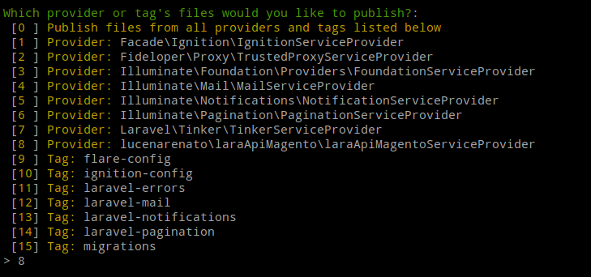

# laraApiMagento - Package Laravel de exemplo para comunicar com magento2 api

<p align="center"><a href="https://packagist.org/packages/lucenarenato/lara-api-magento" target="_blank"></a></p>

`composer require lucenarenato/lara-api-magento`

> Em seguida, precisamos adicionar nosso novo provedor de serviços no arquivo, que fica localizado em config/app.php, dentro da raiz do projeto:

```
    // config/app.php
    'providers' => [
        App\Providers\RouteServiceProvider::class,
        // Our new package class
        \lucenarenato\laraApiMagento\laraApiMagentoServiceProvider::class,
    ],
 ```

 > Em seguida 

 `php artisan vendor:publish`

 <p align="center"><a href="https://packagist.org/packages/lucenarenato/lara-api-magento" target="_blank"></a></p>

## AppServiceProvider

> Adicione no boot

```
Asset::observe(AssetObserver::class);
Organization::observe(OrganizationObserver::class);
```

- https://packagist.org/
- https://packagist.org/packages/lucenarenato/
- https://github.com/lucenarenato/lara-api-magento

"homepage": "https://renatolucena.net",

## Renato Lucena
